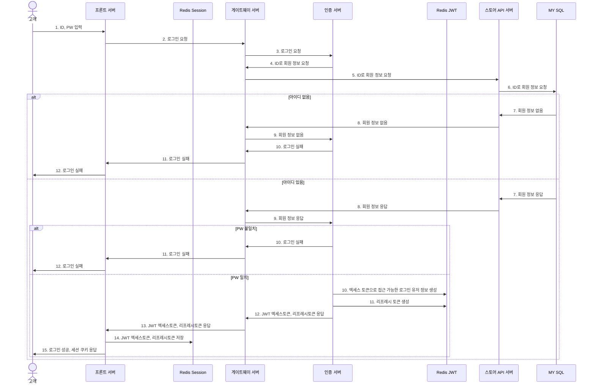
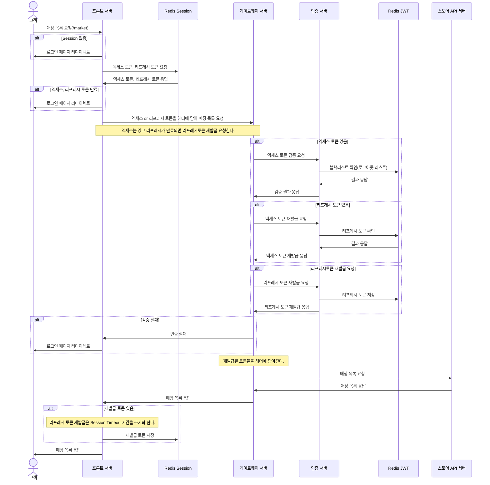

## 메뉴

### 담당자: 김종명

- 메뉴 카테고리, 메뉴, 메뉴옵션, 보조메뉴 조회, 등록, 수정, 삭제
    - 메뉴 삭제시 soft delete
    - 보조메뉴, 옵션 수정 시 존재하는 값은 수정, 존재하지 않는 값은 삭제해 수정, 삭제를 한번에 처리
- toast ui editor 사용
    - wiswyg 텍스트를 그대로 저장, 불러오기 가능
- 메뉴 검색
    - 메뉴 이름과 메뉴 설명으로 검색 매장 검색
    - trigger 를 사용해 menu 저장, 수정, 삭제시 검색 테이블에도 데이터가 자동으로 들어갈 수 있게적용
    - mroonga 플러그인 사용
        - mroonga 를 이용해 메뉴와 메뉴 설명으로 매장 검색
        - full text search 를 통해 검색
- 메뉴를 장바구니에 담을때 매장의 영업상태에 따라 담을 수 없게적용

## 쿠폰

### 담당자: 김종명

- 쿠폰 등록, 조회, 수정, 삭제
- RabbitMQ 를 사용
    - 이벤트 쿠폰 발급에 대한 대규모 트래픽 방지
    - 발급시 에러가 발생했을 때 3번의 시도기회를 주고도 예외가 발생하면 dead letter queue 를 사용해 에러로그로 에러 처리
- JdbcTemplate 에서 제공하는 bulkUpdate 를 사용
    - 이벤트 쿠폰과 같이 한번에 제한되며 많은 데이터를 빠르게 저장
- redis 사용
    - 동시성 처리를 위해 redis 에서 제공하는 rpush, lpop 사용
- 발급쿠폰의 식별키로 uuid 사용
    - 데이터베이스 성능을 위해 정렬된 uuid 사용
    - String 인 uuid 를 binary16 으로 변경해 데이터베이스 저장공간 확보
- 쿠폰 발급시 polling 방식을 사용
    - ajax 통신을 사용해 1초(10초 까지)마다 coupon 서버에 확인
    - 
- 회원가입 쿠폰 발급
    - feignClient 를 사용해 회원가입 쿠폰발급시 다른 api 서버와 통신해 쿠폰 데이터 저장
    - 회원가입시 쿠폰 발급에 문제가 생겨도 회원가입 트랜잭션에는 문제없도록 처리

## 주문, 배달 알림

### 담당자: 김종명, 김현준

- websocket 사용
    - 주문 상태, 배달 상태 알림을 위한 웹소켓 서버개발
    - gateway 에 붙혀서 사용자 인증처리를 gateway 에게 맡기려했지만 https 와 ws 간 연결이 되지 않는 문제 발생
        - websocket 서버를 위한 서브 도메인을 만들어 인증서를 붙혀 wss 통신으로 가능하게 하고 gateway 와 분리해 websocket 서버 내부적으로 사용자 인증을 할 수있게 처리
- Stomp 프로토콜을 사용해 pub/sub 구조로 소켓 연결
    - 주문구독, 배달구독을 나누어 주문, 배달 요청을 구분해 메시지 발행
- RabbitMQ 를 사용
    - 사용자 주문을 받아 대규모 트래픽 방지
    - 3개의 큐를 등록해 대규모 트래픽에 대비해 큐에 주문요청 저장
- redis 사용
    - sub/pub 구조를 사용해 소켓 서버 확장에 대비

## 로그

### 담당자: 김종명

- log & crash 사용
    - 각 api 서버에 대해 error 로그를 수집하고 클라우드 서버에서 모니터링 환경구축

---

## 장바구니 / 주문 / 결제

담당자: 한제우 

- 싱글 페이지 어플리케이션
    - 사용성을 확보하고자 단일 페이지에서 장바구니,주문,결제를 모두 처리 가능하도록 구현
    - 동적으로 할인율 및 잔액을 산정하고 페이지 재 렌더링을 최소화하도록 구현
    - 포인트의 사용이나 쿠폰의 사용이 적용 되더라도 페이지를 다시 로드하지 않음
- 통합결제
    - 여러 가게에서 여러 메뉴 동시 주문 가능
    - 단일 결제 이후 부분 취소 및 환불 가능
- Redis 사용
    - 빈번한 내용 변경이 이루어지는 장바구니에 알맞게 Redis 적용
    - DB의 부하를 줄이고 빠른 응답을 통한 사용성 확보
    - Phantom Key를 사용해 Redis의 TTL 만료 시 DB 자동저장을 통한 데이터 영구 저장 및 복원
- 주문 시 검증
    - Front 서버와 Backend 서버 간  통신 시 주문 내역의 유효성을 검증
    - 결제를 위해 주문서 발행 시 Front 단에서 최소한의 데이터만 전송
    - 이후, 주문서 발행 시 Backend에서 유효성 검증을 통과 후 정리된 데이터를 제공

---

# 인프라

### 담당자 : 김현준

### 아키텍쳐

TODO 아키텍쳐 그림 추가

- L4 Switch
    - 담당자 : 한제우
- Front
    - 담당자 : 전원
- Gateway
    - 담당자 : 김현준
- Eureka
    - 담당자 : 한제우
- Store API
    - 담당자 : 전원
- Coupon API
    - 담당자 : 김종명
- Delivery
    - 담당자 : 김현준
- Batch
    - 담당자 : 이소라
- My SQL
    - 담당자 : 이소라
- Mroonga
    - 담당자 : 김종명
- Redis Session
    - 담당자 : 김현준
- Redis Basket
    - 담당자 : 한제우
- Redis Coupon
    - 담당자 : 김종명
- Rebbit MQ
    - 담당자 : 김종명
- Web Soket
    - 담당자 : 김종명
    - Redis
- Github
    - 프로젝트 관리
- Github Action
    - 담당자 : 김종명, 한제우
    - Store, Eureka, Coupon, Batch, Websoket
- Jenkins
    - 담당자 : 김현준
    - Gateway, Auth, Front, Delivery
- Prometheus
    - 담당자 : 김현준
    - Grafana
    - AlertManager
- 파일 관리
    - 담당자 : 이소라
    - Object Storage
    - Image Manager

### CI/CD

- 젠킨스
- 깃 액션

### Service Discovery

- Spring Cloud Netflix Eureka

### 모니터링

- Prometheus
- Grafana
- AlertManager
    - Dooray Message
- Log & Crash

### 코드 품질 관리

- SonarQube

### Docker

### 부하테스트

- nGrinder

---

# 인증/인가

### 담당자 : 김현준

### 사용 기술

- Spring Boot 2.7.13
- Spring Security
    - 프론트 서버
        - 로그인 사용자에게 권한을 부여하여 접근 제어 (사용자, 휴면계정, 시스템 관리자, 매장관리자, 매장매니저, 매장알바)
        - UsernamePasswordAuthenticationFilter를 상속받아 JWT 로그인 구현
        - OncePerRequestFilter를 상속받아 로그인 검증 구현
        - csrf 사용 및 ChangeSessionId 정책 사용으로 보안 강화
    - 인증 서버
        - 기존 formLogin에 핸들러, AuthenticationProvider를 추가하여 로그인 구현
- JWT
    - 프론트와 백엔드 서버가 분리 되어 있는 환경에서 로그인한 세션의 유저 정보를 백엔드에서 가져오려고 JWT를 선택하게 되었다.
- Spring Cloud Gateway
    - API 호출이 들어오면 필터를 통해 로그인 검증 후 호출

### 설명

- Spring Redis

### 로그인 시퀀스 다이어그램

> 유레카 서버는 생략합니다.
> 

### 로그인 검증 시퀀스 다이어그램

> 유레카 서버, MY SQL은 생략합니다.
로그인 후 동작 가능한 매장 목록 조회(/market)을 예시로 그렸습니다.
> 

---

## 매장

### 담당자 : 김현준, 이소라

- 매장 등록, 수정, 삭제, 조회
    - 매장 등록 시 관련 정보 한번에 등록 처리 → 템플릿 메소드 패턴 이용 → 요소별 API 호출로 순서로 리팩토링 진행
- Validation
    - FrontEnd : javascript, BackEnd : spring validation을 통해 매장 등록 및 수정 시 발생하는 여러가지 경우 검증 진행
- API 비동기 호출
    - 사업자 진위확인 API, 카카오 지도 API 등 다양한 API를 비동기적으로 호출 처리
- 동기적 생성 및 수정
    - 운영시간, 휴일 생성 및 수정 시 페이지를 리로드하지 않고 javascript template을 활용해서 동기적으로 생성 및 수정 처리

## 포인트

### 담당자 : 김현준, 이소라

- 포인트 사용, 적립, 환불, 조회

## 리뷰

### 담당자: 이소라

- 리뷰 등록, 수정, 삭제, 조회
- 리뷰 이미지 다중화를 통해 한 리뷰에 여러 이미지를 등록, 수정할 수 있도록 처리
- 해당 주문 및 매장에 관련된 총 리뷰를 작성한 후, 주문한 메뉴에 대해서도 메뉴 리뷰를 작성할 수 있도록 처리
    - 해당 총 리뷰에서 메뉴 리뷰가 존재한다면 메뉴 리뷰를 수정할 수 있고, 메뉴 리뷰가 존재하지 않는다면 메뉴 리뷰를 작성할 수 있도록 동적으로 처리
- 각각의 메뉴와 메뉴 리뷰를 연동하여 메뉴에서 별점 및 리뷰 확인 가능
- 최신순, 낮은별점순, 높은별점순, 평균 평점 및 리뷰 수 등 통계기능 제공

## 파일

### 담당자: 이소라

- 파일 업로드, 다운로드, 수정, 삭제 처리
- 다양한 스토리지 저장
    - 로컬 서버, 오브젝트 스토리지, 이미지 매니저 등 다양한 스토리지에 파일을 저장할 수 있도록 프록시패턴을 활용
        
        → 이미지 저장 시 이미지 매니저, 이미지 이외의 확장자 저장 시 오브젝트 스토리지에 저장
        
- 비동기 방식을 활용한 기능 분리
    - 파일을 등록 form의 post 요청 시 함께 건네지 않고, 기능을 별도로 분리하여 javascript 비동기 방식으로 파일 생성 요청을 보낸 후 생성된 결과값(파일 식별번호)을 가지고 form post 제출함
- 파일 Multiple 기능
    - 파일은 multiple로 생성 및 수정이 가능하며, 파일 수정 시 기존 파일과의 갯수를 비교하여 증감분만큼 생성하거나 삭제함
- 권한 확인
    - 사업자 등록증 등 보안이 필요한 파일의 경우 업로더 회원 식별번호와 요청 회원 식별번호를 비교 후 다운로드 권한 확인
- 예외 처리
    - 파일 아이디가 null이거나, url은 존재하나 http 요청 후 존재하지 않는 파일임이 확인될 경우 특정 파일 호출
- 이미지 썸네일 유연화 
    - 이미지 요청 시 파라미터를 통해 원하는 썸네일대로 이미지를 생성 및 호출할 수 있음

## Batch

### 담당자: 이소라

- 휴면회원 갱신, 회원등급 갱신, 생일 및 기념일 쿠폰 발급
- 다양한 JDBC API 중 MyBatis 선택
    - JPA(Hibernate), JDBC Templates, MyBatis 중 bulk insert가 가능하고 기본키 전략을 사용하지 않는 Mybatis 선택
    - `MyBatisCursorItemReader` 사용
- 데이터베이스 다중화
    - Batch 서버에서 두개의 데이터베이스(Store 데이터베이스, Coupon 데이터베이스)에 접근해야하므로, 각각의 `DataSource`, `SqlSessionFactory`, `PlatformTransactionManager`을 설정함
    - `DefaultBatchConfigurer`에서 사용하는 Primary DataSource는 Store 데이터소스
    - 쿠폰 발급 시, TransactionManager만 쿠폰 TransactionManager를 사용
- 배치 예외처리
    - retry 정책 : `ConnectTimeoutException`의 경우에만 최대 3번 재실행
    - skip 정책 : 모든 exception에 대해 모두 skip하고 no rollback 적용 → 결과적으로 문제없는 케이스는 DB에 저장되고 오류로 인해 DB에 저장되지 않는 데이터는 로그 및 두레이 알림으로 기록된다.
    - 배치 코드 재실행해도 문제 없도록 작성

---

# Skill set

### Language

### Framework

 

 

### Database

### Build Tool

### CI/CD

### DevOps

### ETC

### Front

